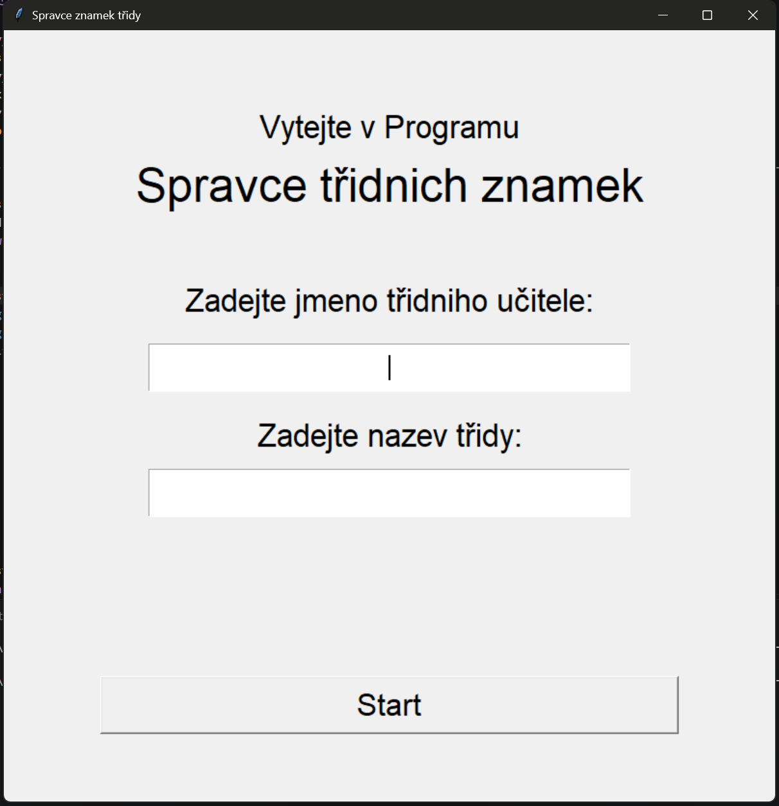
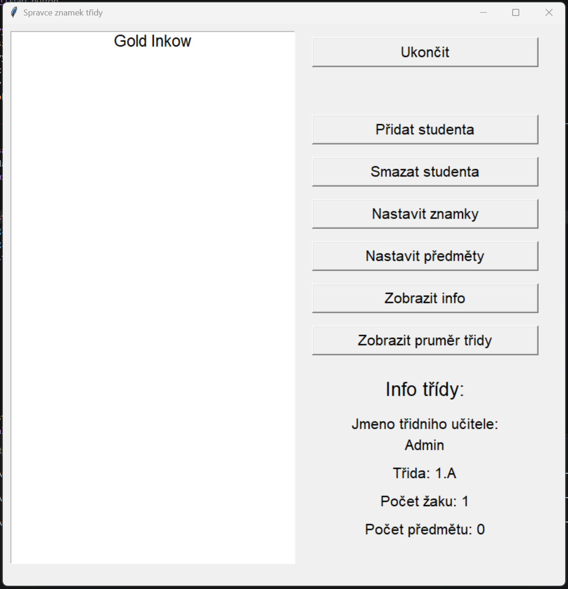

# Správce známek třídy

Jednoduchá desktopová aplikace pro správu studentů a jejich známek. 
Vytvořeno v Pythonu s Tkinterem.

## Funkce

- Přidávání studentů (jméno, příjmení, věk)
- Mazání studentů
- Nastavení předmětů (max 9)
- Přidávání a mazání známek
- Zobrazení informací o studentovi
- Výpočet průměru třídy
- Ukládání dat do JSON

## Jak spustit

1. Nainstaluj Python 3.10+
2. Spusť `main.py`
3. Zadej jméno učitele a třídy
4. Přidej studenty a předměty
5. Užívej!

## Požadavky

- Python 3.10+
- Tkinter (součást Pythonu)

## Co plánuji s projektem dělat dál

Program jsem dělal pro cvičení kódování, nepočítal jsem, že vyroste až na ~600 řádků.
Ale i tak jsem na něm pečlivě pracoval, i když na něm pořád vidím chyby.

Jestli se někdy budu vracet k menším projektům, jako je tenhle, udělám ho funkčnější pro více instrukcí.
(Např. info o známkách, více známek – písemky, více místa pro předměty atd.)

## Screenshoty

